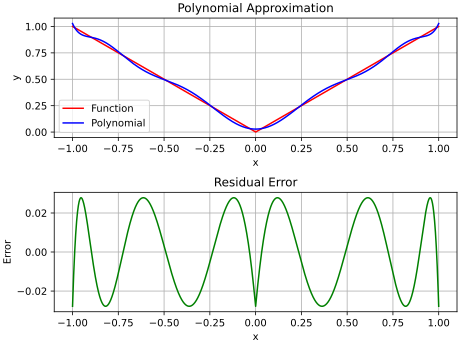

# Chebyshev Approximation using polynomials on a Linear Grid.

The Python files in this repository are implementations of the first and second
algorithms of Remes. The algorithms are used for finding a polynomial of best
approximation to a function. The purpose is to investigate the limitations and
issues when implementing the algorithms in the most straight-forward concise
manner. A number of test cases are included.

The algorithms are applied over a real interval $[a, b]$. To simplify the
implementation, the interval is constructed as a set of grid points arranged in
ascending order. The interval between each point is equal.

The algorithms consist of the following steps:

1. Select a starting set of test points
2. Calculate the test polynomial for best approximation at the test points
3. Calculate the residual error over the grid
4. Check if the calculation is completed.
5. Update the set of test points and go back to step 2.

For the first algorithm only a single test point is updated at step 5. Whereas
with the second algorithm it is possible for all test points to be updated.

A test polynomial is calculated by constructing a linear system, which is
solved using the standard numpy LDU solver. Both the polynomial coefficients
and residual error at the test points are evaluated. Then, the residual error is
calculated at each grid point using direct evaluation of the test polynomial.
In order to identify the exchange points a linear search over the grid for
maximum and minimum residual error points is used.

The standard Python float type is used for all calculations.

## Dependencies

The code is written in Python and assumes that version 3.9 or later
is installed on the computer. The code utilises the NumPy 1.19.5 and
Matplotlib 3.3.4 packages. Later package versions should cause no issue.

## Files

<table>
    <tr>
        <th>Filename</th>
        <th>Description</th>
    </tr>
    <tr>
        <td>remes_first_algorithm.py</td>
        <td>Implementation of the first algorithm of Remes.</td>
    </tr>
    <tr>
        <td>remes_second_algorithm.py</td>
        <td>Implementation of the second algorithm of Remes.</td>
    </tr>
    <tr>
        <td>utiliy.py</td>
        <td>Some functions to plot results with Matplotlib.</td>
    </tr>
    <tr>
        <td>convert.py</td>
        <td>Convert a raw sensor reading to a calibrated
        value. This function is used by some of the tests.</td>
    </tr>
    <tr>
        <td>abs_first_algorithm.py</td>
        <td>Use the first algorithm find a polynomial approximation to
        the <em>abs</em> function on the interval [-1.0, +1.0].</td>
    </tr>
    <tr>
        <td>abs_second_algorithm.py</td>
        <td>Use the second algorithm find a polynomial approximation to
        the <em>abs</em> function on the interval [-1.0, +1.0].</td>
    </tr>
    <tr>
        <td>abs_transform_sqrt.py</td>
        <td>Use the second algorithm find a polynomial approximation to
        <em>sqrt(x)</em> on the interval [0.0, +1.0]. Then transform this by
        substitution with <em>x -> y**2</em> to give the best approximation to
        <em>abs(y)</em>.</td>
    </tr>
    <tr>
        <td>alaw_first_algorithm.py</td>
        <td>Use the first algorithm find a polynomial approximation to
        the <em>A-LAW</em> conversion on the interval [-1.0, +1.0].</td>
    </tr>
    <tr>
        <td>alaw_second_algorithm.py</td>
        <td>Use the second algorithm find a polynomial approximation to
        the <em>A-LAW</em> conversion on the interval [-1.0, +1.0].</td>
    </tr>
    <tr>
        <td>clipped_sine_first_alogirthm.py</td>
        <td>Use the first algorithm find a polynomial approximation to
        a <em>Clipped-Sine</em> function on the interval [-pi, +pi].</td>
    </tr>
    <tr>
        <td>clipped_sine_second_alogirthm.py</td>
        <td>Use the second algorithm find a polynomial approximation to
        a <em>Clipped-Sine</em> function on the interval [-pi, +pi].</td>
    </tr>
    <tr>
        <td>conversion_first_algorithm.py</td>
        <td>Use the first algorithm find a polynomial approximation to a
        sensor <em>Conversion</em> problem.</td>
    </tr>
    <tr>
        <td>conversion_second_algorithm.py</td>
        <td>Use the second algorithm find a polynomial approximation to a
        sensor <em>Conversion</em> problem.</td>
    </tr>
    <tr>
        <td>tan_first_algorithm.py</td>
        <td>Use the first algorithm find a polnomial approximation to
        the <em>tan</em> function on the interval [0.0, 0.25*pi].</td>
    </tr>
    <tr>
        <td>tan_second_algorithm.py</td>
        <td>Use the second algorithm find a polnomial approximation to
        the <em>tan</em> function on the interval [0.0, 0.25*pi].</td>
    </tr>
<table>

## Results

A number of test cases of interest were selected. The first and second
algorithms were used to estimate a polynomial of best approximation.

### Approximation of the *abs* function

The objective of this test is to find a $10^{th}$ order polynomial that provides
the best Chebyshev approximation to the $abs$ function on the real interval
$[-1.0, +1.0]$. Both and first and second algorithms are tested.

A linear grid of $9999$ points on the interval $[-1.0, +1.0]$ is used. The first
grid point is located at $-1.0$ and the last at $+1.0$. Since there are an odd
number of grid points the mid grid point is located at $0.0$.

The first and second algorithms are only terminated when the magnitude of
residual error at the test points ceases increasing. The magnitude of the
residual at the test points is also referred to as the *level error*. At each
iteration the level error is compared to that obtained by the previous
iteration. If the level error has increased by less than a factor of
$1.000000000000001$ over the previous iteration the algorithm is halted. Once
the algorithm has halted the magnitude of the residual error is calculated at
each grid point and the maximum value identified. The calculation time of a
test is also measured. This is the run-time of the calculation thread.
<table>
    <tr>
        <th>Algorithm</th>
        <th>Iterations</th>
        <th>Duration (secs)</th>
        <th>Peak Error Magnitude</th>
    </tr>
    <tr>
        <td>First</td>
        <td>32</td>
        <td>0.0071</td>
        <td>2.784511444310045e-02</td>
    </tr>
    <tr>
        <td>Second</td>
        <td>9</td>
        <td>0.0034</td>
        <td>2.784511444310045e-02</td>
    </tr>
</table>

The second algorithm requires less iterations to complete because there are
potentially up to 12 test points updated at each iteration. However the second
algorithm requires more calculations at each iteration. Neverless the second
algorithm requires about 50% less time to complete for these tests. Since both
algorithms use that same halting criteria the magnitude of the peak error is the
same for for both. Both tests also calculated identical polynomial coefficients
as well. The test application plotted the $abs$ function and approximating
polynomial over the interval $[-1.0, +1.0]$. A second plot of the residual error
over the interval is also made.

The polynomial approximation of the $abs$ function over the interval
$[-1, +1]$ is an example first presented by Remes[\[1\]](#remes-01) in 1934.
The same example was used by Ricardo Pachón[\[2\]](#pachon-01) to demonstrate
the capabilities of *Chebfun*, a MATLAB toolbox.

### Approximation of the *A-LAW* function

### Approximation of the *Clipped-Sine* function

### Approximation of the sensor *Conversion* table

### Approximation of the *tan* function

## Comments

## References

1. **Eugène Remes**: *Sur le calcul effectif des
polynomes d’approximation de Tchebychef*, Comptes Rendus (1934), 199,
pages 337–340.

2. **Ricardo Pachón and Lloyd N. Trefethen**:
*Barycentric-Remez algorithms for best polynomial approximation in the chebfun
system*, BIT Numer Math (2009), 49, pages 721–741.

3. **Richard S. Varga and Amos J. Carpenter**:
*On the Bernstein conjecture in approximation theory*, Constuctive
Approximation (1985), 1, pages 333–348.

